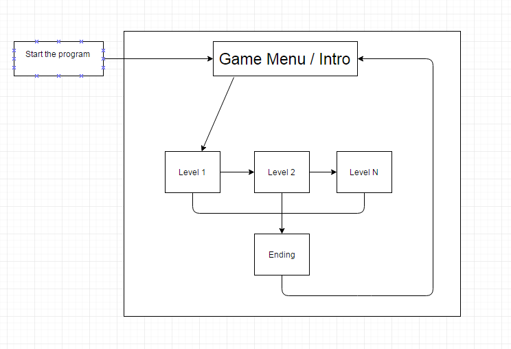

<h3>Final C++ Project: Pacman</h3>
This is a simple Pacman-like game that Chasek99 and I worked on.
When the program is started, an intro menu appears, giving instructions on how to play.
The start menu also asks for the user to pick a difficulty and to input a name for themselves and the computer to play as.
Once those have been picked, the game starts with the user and the computer/ghost on opposite ends of the map.
The "ghost" leaves decimal points along the map that the user must collect to accumulate points.

We had some trouble getting past the first map. We were able to get the map to change once the user hit a certain amount of points,
however, it would bug out and the user's pacman would eat through walls and invisible walls would appear. We tried working it out but 
didn't have the time to complete this. We decided to scrap it from our final cut of the program since it didn't really meet our 
standards we set out in our flowchart.

